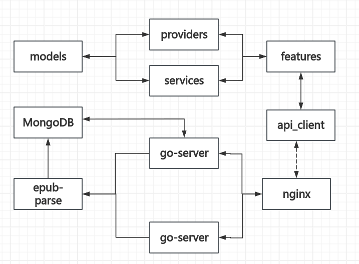
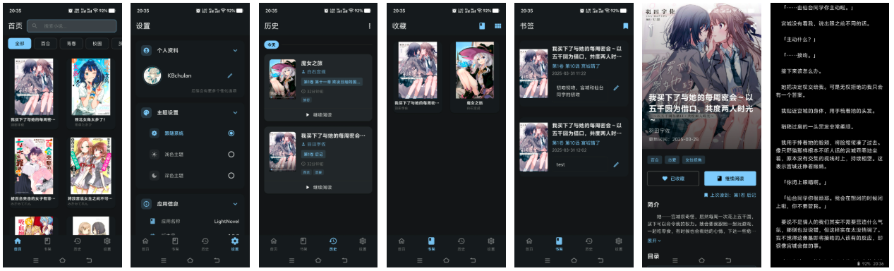

# lightNovel

&ensp;&ensp;基于flutter开发的轻小说的app，后端用的go语言，然后整个项目架构是REST API，差不多是这样，如果您有看小说的兴趣，完全可以自己跑一下或者直接使用我们的Release版本。

## 🌟 与一般小说app的区别

&ensp;&ensp;1. **无需登录注册**：采用uuid作为标识，因此不需要担心任何权限问题，什么都没有要，很多个性化功能也是支持的，而且主要是小说(服务器代码也是开源的，完全可以查看)

&ensp;&ensp;2. **书签功能**：我原来看小说到一些很喜欢的地方，但是没有书签功能，所以就自己写了一个，不仅可以随时定位到原有的位置，而且不干扰阅读历史，可以随时重温

&ensp;&ensp;3. **自定义上传**：后续会开放一个enup上传接口，可以上传自己比较喜欢的小说，后端会解析到mongoDB里，这样就可以查看了

&ensp;&ensp;4. **个性化阅读**：支持字体大小调节、主题切换、阅读背景自定义等功能，让阅读体验更舒适

&ensp;&ensp;5. **离线缓存**：支持章节缓存，没网的时候也能愉快地看小说

## 🛠️ 技术栈

### 前端 (Flutter)

- **框架**: Flutter 3.2.3+
- **状态管理**: Riverpod
- **路由**: GoRouter
- **网络请求**: Dio
- **UI组件**: Material Design 3 + FlexColorScheme
- **本地存储**: SharedPreferences

### 后端 (Go)

- **框架**: Gin
- **数据库**: MongoDB
- **缓存**: Redis + BigCache
- **WebSocket**: Gorilla WebSocket
- **API文档**: Swagger
- **配置管理**: Viper

## 📱 主要功能

- 📚 **小说阅读**: 流畅的阅读体验，支持翻页动画
- 🔖 **书签管理**: 随时标记喜欢的段落，快速定位
- 📖 **阅读历史**: 自动记录阅读进度，断点续读
- 🎨 **主题定制**: 多种阅读主题，护眼模式
- 🔍 **搜索功能**: 快速查找小说和章节
- 💾 **离线缓存**: 预下载章节，离线也能看
- 🌙 **夜间模式**: 深色主题，保护视力
- ⚙️ **个性设置**: 字体、字号、行距等自定义调节

## 🏗️ 架构设计图



## 📸 效果截图



## 🚀 快速开始

### 环境要求

- **Flutter**: 3.2.3 或更高版本
- **Go**: 1.23.0 或更高版本
- **MongoDB**: 4.4 或更高版本
- **Redis**: 6.0 或更高版本

### 安装运行

#### 1. 克隆项目

```bash
git clone https://github.com/your-username/lightNovel.git
cd lightNovel
```

#### 2. 启动后端服务

```bash
cd server/go-server
go mod tidy
go run main.go
```

#### 3. 启动Flutter应用

```bash
cd client
flutter pub get
flutter run
```

### 配置说明

&ensp;&ensp;后端配置文件位于 `server/go-server/config/` 目录下，需要配置MongoDB和Redis连接信息。具体配置项请参考配置文件中的注释。

## 📁 项目结构

```
lightNovel/
├── client/                 # Flutter前端应用
│   ├── lib/               # 主要代码目录
│   ├── assets/            # 资源文件
│   └── pubspec.yaml       # Flutter依赖配置
├── server/                # 后端服务
│   └── go-server/         # Go服务端
│       ├── api/           # API路由
│       ├── internal/      # 内部逻辑
│       ├── pkg/           # 公共包
│       └── config/        # 配置文件
├── docs/                  # 文档和图片
├── dbbackup/             # 数据库备份
└── README.md             # 项目说明
```

## 🤝 贡献指南

&ensp;&ensp;欢迎提交Issue和Pull Request！如果您有好的想法或者发现了bug，都可以通过GitHub与我们交流。

## 📄 开源协议

&ensp;&ensp;本项目采用 [MIT License](LICENSE) 开源协议。

## 💡 后续计划

- [ ] 支持更多小说源
- [ ] 添加评论功能
- [ ] 实现小说推荐算法
- [ ] 支持语音朗读
- [ ] 添加社区功能
- [ ] 优化搜索算法

---

&ensp;&ensp;如果这个项目对您有帮助，欢迎给个⭐️支持一下！有任何问题都可以在Issues中提出。
